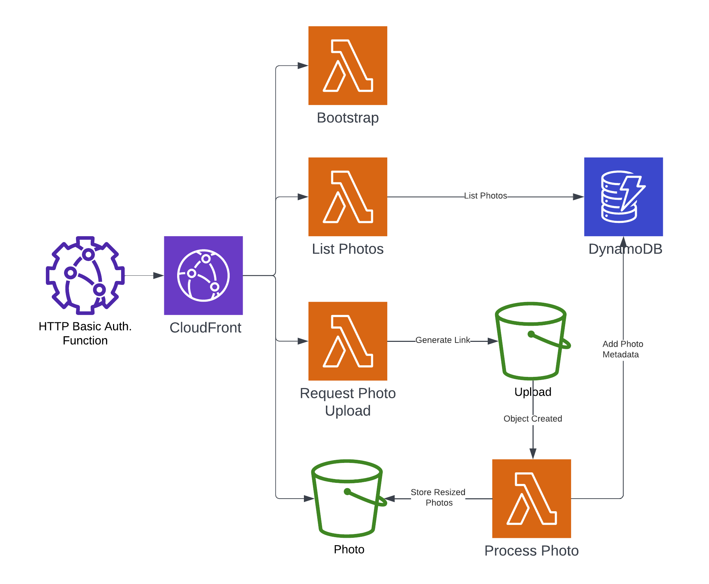

# Our Wedding Gallery

Serverless photo gallery with the ability to upload and view photos within an infinite scrolling list.

🌎 [Website](https://github.com/eddmann/our-wedding-website) | 📷 Gallery | 🏗️ [Infrastructure](https://github.com/eddmann/our-wedding-infra)

## Overview

<p align="center"> </p>

In the tradition of over engineering a problem related to our upcoming wedding - we really did not want resized/compressed photos shared through WhatsApp/iMessage of the day.
So instead, I decided to create a simple photo gallery site which provides guests with the ability to share the the original photos in one place.

- Local development enviornment which replicates production using [Serverless Offline](https://github.com/dherault/serverless-offline).
- Serverless JavaScript RESTful API using [HAL](https://stateless.group/hal_specification.html).
- Create React App and Tailwind CSS-based client single-page application, hosted statically on S3.
- Uploaded photos stored within S3 using pre-signed POST requests.
- Photos resized upon successful upload to S3 (in WebP format) using Lambda and Node.js [Sharp library](https://github.com/lovell/sharp).
- Photo metadata stored within DynamoDB using a [Single-Table Design](https://www.alexdebrie.com/posts/dynamodb-single-table/).
  Uses a _hot key_ for presenting the listed gallery 😬, so as to take advantage of the timestamp-based sort key.
- CI pipeline developed using [GitHub workflows](.github/workflows/), deploying the API and client to the given stage-environments (staging and production).

## Getting Started

```
make client/install api/install
make client/dev/start
make api/dev/start
```

## Architecture

<p align="center"></p>
